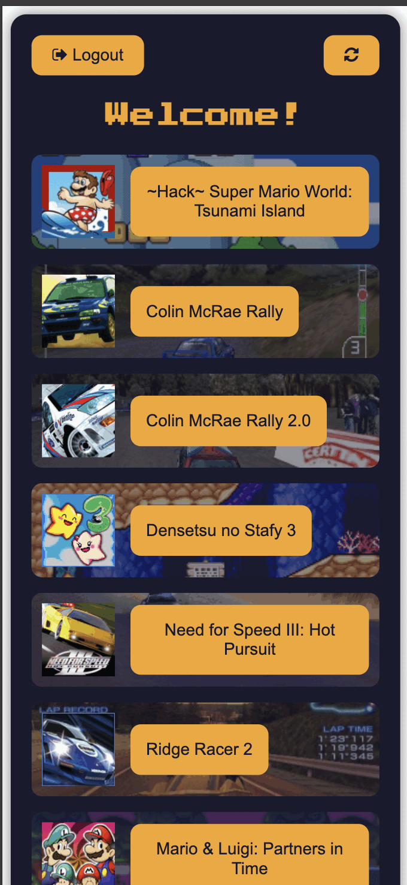

# Retro leaderboards

Retro leaderboards is a small easy to use [Retroachievements.org](https://retroachievements.org) companion website (mobile first design) that allows you to compare your recently played games leaderboards with your friends.
You only need two things in order to use it: your username and your web api key (which can be gathered from your [setting page](https://retroachievements.org/settings), under the _Keys_ section)

## What technologies does it use?

This small webpage is built using [VITE](https://vite.dev) and [VUE](https://vuejs.org). Uses [GitHub Pages](https://pages.github.com) to host.
It uses local storage to keep track of visited games information (so we don't overwhelm the server each time we navigate through pages).
Sensitive data is stored using [crypto-js](https://www.npmjs.com/package/crypto-js). Testing aiming for full code coverage with [Cypress](https://www.cypress.io).

## Is it safe?

It tries to. Always keeping in mind that is a frontend application running in your browser which are never exempt of risks.

- So how does it try to be safe?
  - Basically it encrypts sensitive data before storing it to local storage.
- Why does it store the data in first place?
  - So you don't have to fill it up every time you want to use the app.
- What if I don't want to keep my secrets stored?
  - Then you could log out after each use and all your stored data will be deleted.

## How to build

Create a .env file in your project's root folder.
```.env
VITE_API_URL=https://retroachievements.org
VITE_ENCRYPTION_KEY=example
```

Install node, at least version 18. First run `npm install` and then `npm run dev`.
The project should be accessible via http://localhost:5173/retroleaderboards/.

## Screens
